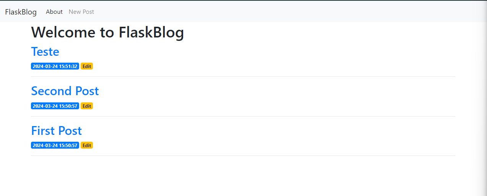

<div align="center">
  <h1>Flask Blog</h1>
  <p>Flask blog é uma aplicação de um blog, com cadastro post, edição e exibição, desenvolvido em Python utilizando o framework Flask e o banco de dados SQLite para salvar o conteúdo.</p>
  
</div>

# 📒 Índice
* [Descrição](#descrição)
* [Requisitos Funcionais](#requisitos)
  * [Features](#features)
* [Tecnologias](#tecnologias)
* [Design](#design)
  * [Cores](#cores)
  * [Fontes](#fontes)
* [Instalação](#instalação)
* [Licença](#licença)

# 📃 <span id="descrição">Descrição</span>
Flask blog é uma aplicação de um blog, com cadastro post, edição e exibição, desenvolvido em [**Python**](https://www.python.org/) utilizando o framework [**Flask**](https://flask.palletsprojects.com/en/3.0.x/) e o banco de dados [**SQLite**](https://www.sqlite.org/) para salvar o conteúdo. Projeto para fim de estudos.

# 📌 <span id="requisitos">Requisitos Funcionais</span>
- [x] Cadastro de post<br>
- [x] Exibir post<br>
- [x] Listar posts<br>
- [x] Exibição de post<br>

## Features
- [x] Responsividade<br>
- [x] Listar posts por data e hora<br>

# 💻 <span id="tecnologias">Tecnologias</span>
- **HTML**
- **CSS**
- **Python**
- **Flask**
- **Jinja2**
- **Werkzeug**
- **SQLite**
- **Bootstrap**

# 🎨 <span id="design">Design</span>
- O modelo final para versão desktop e mobile está disponível na pasta `./design`

- <span id="cores">Cores<br></span>
  * #212529<br>
  * #0056B3<br>
  * #FFC107<br>
  * #C82333<br>

- <span id="fontes">Fontes<br></span>
  * Arial, sans-serif

# 🚀 <span id="instalação">Instalação</span>
```bash
  # Clone este repositório:
  $ git clone https://github.com/CleilsonAndrade/flask_blog.git
  $ cd ./flask_blog

  # Criar ambiente virtual:
  $ python3 -m venv virtual

  # Ativar ambiente
  $ source virtual/bin/activate

  # Instalar dependências:
  $ pip install -r requirements.txt

  # Iniciar banco de dados:
  $ python init_db.py

  # Executar:
  $ export FLASK_ENV=app && export FLASK_ENV=development && flask run
```

# 📝 <span id="licença">Licença</span>
Esse projeto está sob a licença MIT. Veja o arquivo [LICENSE](LICENSE) para mais detalhes.

---

<p align="center">
  Feito com 💜 by CleilsonAndrade
</p>